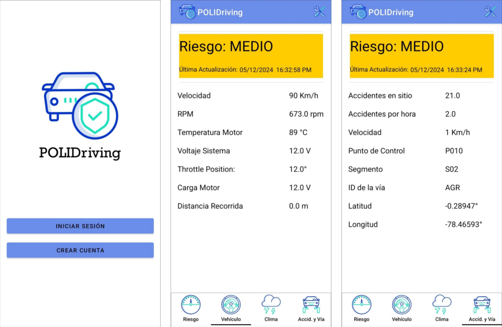
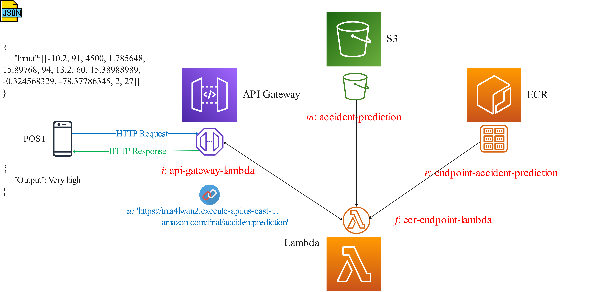

# POLIDriving Mobile App

POLIDriving Mobile is an application for Adndroid devices that calculates the risk level of suffering a traffic accident in real-time. The following figure presents the graphic user interface of POLIDriving Mobile.

## Technologies

This application was developed in <a href=https://nodejs.org/en>Java</a> and uses some services from AWS, such as Cognito and DynamoDB. It also uses a learning model hosted in S3 and available for consumption through an API REST. The following figure presents the AWS-based infrastructure used by the POLIDriving app.

# Publication

If you use POLIDriving in your research, please cite it as follows.

@article{marcillo2024polidriving, 
  title={POLIDriving: A Public-Access Driving Dataset for Road Traffic Safety Analysis}, 
  author={Marcillo, Pablo and Arciniegas-Ayala, Cristian and Valdivieso Caraguay, {\'A}ngel Leonardo and Sanchez-Gordon, Sandra and Hern{\'a}ndez-{\'A}lvarez, Myriam}, 
  journal={Applied Sciences},
  volume={14}, 
  number={14}, 
  pages={6300}, 
  year={2024}, 
  publisher={MDPI} 
}

# Downloads

The size of POLIDriving is about 150 MB.

# Contact

For questions or suggestions, please contact pablo.marcillo@epn.edu.ec
